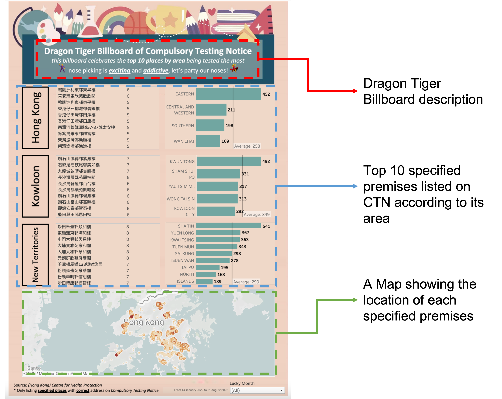

  <h1>
    Dragon Tiger Billboard
  </h1>
  <h3>
    <i>Rankings of Buildings Subject to Compulsory COVID Testing in Hong Kong</i>
  </h3>
  
  

    <i>Credit: <a href="https://www.info.gov.hk/gia/general/202202/10/P2022021000374.htm">info.gov.hk</a></i>
  

Click [me](https://public.tableau.com/app/profile/jackcky/viz/HongKongCompulsoryTestingNoticeDragonTigerBillboard/DTB) to travel Tableau dashboard!

---
### Background
- Under the pandemic of COVID-19, the Hong Kong Government (HKG) is striving to achieve "Dynamic Zero Infection" by introducing vaccine passports to encourage the public to get vaccinated.
- In addition, the HKG exercises the power of the Prevention and Control of Disease Ordinance (Chapter 599) to require the public to undergo a COVID-19 nucleic acid test if they have been present at a specified premise.
- Earlier, we found an interesting [post](https://forum.hkgolden.com/thread/7600216/page/1) in HKGolden discussing the annoyance of the Compulsory Testing Notice (CTN) and the search for a Dragon Tiger Billboard (a.k.a. 龍虎榜 in Chinese or ranking billboard in English) to see which buildings appeared on the CTN the most.
- Unfortunately, there is no such official publication for the ranking on the CTN. We were inspired by the idea and kicked off a project to build a Dragon Tiger Billboard that would visualise the frequency of specified premises being listed on the CTN.

---
### Dashboard Demo

  

---
### Data Source
Due to the absence of tabular data on CTN, data is drawn from [PDF files](https://www.chp.gov.hk/en/features/105294.html) available on the Centre for Health Protection (CHP). External data, such as geocoding of addresses, will also be extracted. Data processing is done using Python scripts.

---
### Project Implementation
1. Download CTNs from the CHP at the start of the project.
    -  Capture CTNs since January 14, 2022, due to inconsistent table formats
    -  Ensure CTN records are up-to-date, with the latest data as of August 31, 2022
2. Extract information from PDFs to build a data model.
    -  For configuring dependencies, ingest only the "指明地點 Specified place" column
    -  Remove places with typos or without a [sub-district](https://www.rvd.gov.hk/doc/tc/hkpr15/06.pdf)
    -  Reference geographic information of the given addresses using the [Hong Kong Address Parser](https://github.com/chunlaw/HKAddressParser)
3. Save the output, which will act as a data source for the dashboard.
4. Build a Dragon Tiger Billboard to display the frequency of specified premises on the dashboard.

  

---
### Dashboard Explanation

  

---
### Acknowledgements
- The dashboard design is stolen from the [Homework Dragon Tiger Billboard](https://hodao.edu.hk/CustomPage/131/2020-2021_05月份交齊功課龍虎榜.jpg), Ho Dao College.
- The usage of Tabula-py is referenced from [here](https://aegis4048.github.io/parse-pdf-files-while-retaining-structure-with-tabula-py), which provides a detailed introduction to the framework.
