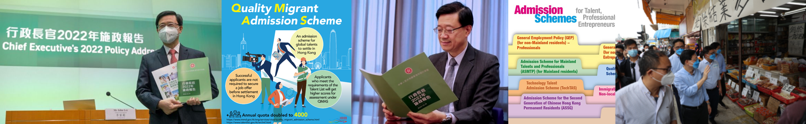
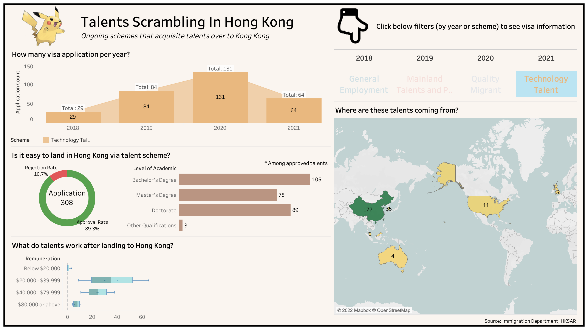

    <h1>
        Every Page Ask
    </h1>
    <h3>
        <i>Scrambling Talent to Hong Kong for the Development of an International Innovation and Technology Center</i>
    </h3>
    
    

        <i>Credit: <a href="https://www.immd.gov.hk/eng/services/visas/quality_migrant_admission_scheme.html">immd.gov.hk</a></i>
    

Click [me](https://public.tableau.com/app/profile/jackcky/viz/TalentsScramblinginHongKong/HongKongTalentScrambling) to see how Hong Kong _ROBS_ talents over the world!

---
### Background
- The Hong Kong Chief Executive, John Lee Ka-Chiu, has a [plan](https://www.thestandard.com.hk/sections-news-print/245175/HK-lagging-in-global-talent-scramble) to acquire more global talents to strengthen Hong Kong's expertise in leading fields of innovation and technology.
- Currently, there are several schemes for foreigners to apply for a work permit (visa) in Hong Kong, including General Employment Policy, Mainland Talents and Professionals, Quality Migrant Admission Scheme, and Technology Talent Admission Scheme.
- We believe it would be interesting to understand the current talent recruitment process while watching, with packs of peanuts, how Mr. Lee will "spare no effort" to attract skilled people to land in Hong Kong.

---
### Dashboard Demo

 

---
### Data Source
The figures on visa applications are available from the [Hong Kong Immigration Department](https://www.immd.gov.hk/eng/facts/visa-control.html). As they are published officially, the data is assumed to be accurate and error-free. Data processing is done using Excel, and scraping is performed with a no-code development approach.

---
### Implication
- Over the past 4 years, only 308 IT talents applied for a visa through the Technology Talent Admission Scheme. There was a drop in applications in 2021 due to the COVID-19 situation.
- More than one-third of these talents only received their bachelor's degree, which is not a qualification that is sufficient for developing the Innovation and Technology Centre.
- The majority of talents came from the same place, China. This shows that the scheme might not be attractive to immigrants or may not be designed for global talents.

 

---
### Acknowledgements
- The data source is refreshed from [Data Gov HK](https://data.gov.hk/en-datasets/provider/hk-immd), an open data bank published by the Hong Kong Government.
