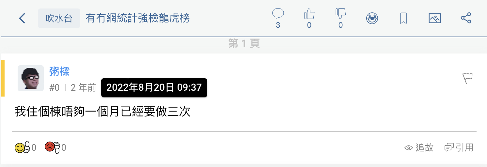
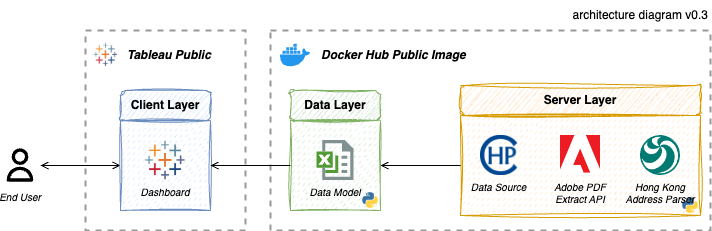
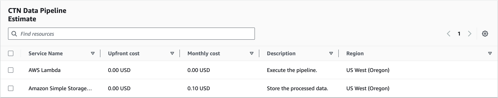

<!-- TITLE -->
# 💉 Compulsory COVID Testing Monitor


<!-- BACKBROUND -->
<div align="center">
  <div class="headline">
    <a href="https://www.chp.gov.hk/files/pdf/ctn.pdf">
      
    </a>
  </div>
  <div class="badge">
    <a href="https://public.tableau.com/app/profile/jack.cky/viz/HongKongCompulsoryTestingNoticeDragonTigerBillboard/CTN"></a>
    <a href="https://hub.docker.com/r/jackcky/ctn-monitor"></a>
  </div>
</div>

<br>Amid COVID-19 pandemic, the Hong Kong Government (HKG) was striving to achieve _Dynamic Zero Infection_ by introducing vaccine passports to encourage public vaccinations. Furthermore, HKG was exercising its power under the Prevention and Control of Disease Ordinance (Chapter 599) to require those who had been present at specified premises to undergo a COVID-19 nucleic acid test.

To effectively monitor the COVID situation, we have built an end-to-end pipeline solution that gathers data and builds a dashboard. This dashboard allows the public (end users) to understand the current pandemic status and alerts them to potential outbreaks in their neighbourhoods.

<div align="right">
  <p>
    <i>Image Credit: <a href="https://www.info.gov.hk/gia/general/202202/10/P2022021000374.htm">info.gov.hk</a></i>
  </p>
</div>

**First Published:** 25 August 2022  
**Last Updated:** 23 August 2024


<!-- ROADMAP -->
## Table of Contents
- [1 - Motivation](#1)
- [2 - How Many Times You Have Been Selected?](#2)
    - [2.1 - Finding the Latest Updates](#2.1)
    - [2.2 - Hosting Your CTN Monitor](#2.2)
- [3 - Solution Architecture](#3)
    - [3.1 - Production Scenario](#3.1)


<!-- SECTION 1 -->
<a name="1"></a>

## Motivation: Visualise the Compulsory Test Frequency
Earlier, we came across an intriguing [post](https://forum.hkgolden.com/thread/7600216/page/1) on HKGolden discussing the nuisances caused by the Compulsory Testing Notice (CTN) and the desire for a _Dragon Tiger Billboard_ (also known as 龍虎榜 in Chinese or ranking billboard in English), which ranks the buildings appearing most frequently on the CTN.

Unfortunately, there was no official publication providing such a ranking. The CTN was presented in PDF format, making it challenging to grasp the status of each location. Inspired by this idea, we initiated a project to create a dashboard that conveniently visualises the frequency of specified premises being listed on the CTN.

<div align="center">
  <a href="https://forum.hkgolden.com/thread/7600216/page/1">
    
  </a>
</div>


<!-- SECTION 2 -->
<a name="2"></a>

## How Many Times You Have Been Selected?
If you resided in Hong Kong in 2022, it is likely you were asked to undergo a COVID test. However, do you know how many times you were officially asked to take a test?

<a name="2.1"></a>

### Finding the Latest Updates
Simply visit **Compulsory COVID Testing Monitor** on [Tableau Public](https://public.tableau.com/app/profile/jack.cky/viz/HongKongCompulsoryTestingNoticeDragonTigerBillboard/CTN) and you can find the most recently affected buildings.

> [!IMPORTANT]  
> The last record of CTN was on 23 December 2022.

<div align="center">
  <a href="https://public.tableau.com/app/profile/jack.cky/viz/HongKongCompulsoryTestingNoticeDragonTigerBillboard/CTN">
    
  </a>
</div>

<a name="2.2"></a>

### Hosting Your CTN Monitor Pipeline
You can host the data pipeline in your preferred environment. The instructions below will guide you through the deployment process. We use [Adobe PDF Extract API](https://developer.adobe.com/document-services/apis/pdf-extract/) in the pipeline, which requires API credentials. You can create one for free by following their [instructions](https://developer.adobe.com/document-services/docs/overview/pdf-extract-api/quickstarts/python/).

> [!CAUTION]  
> The pipeline is deprecated because we already achieved _Dynamic Zero Infection_ 👌🏻.

<details>
  <summary>💻 Local Host (Recommended)</summary>
  <div class="local_host">
    <p class="preface">
      Being lightweight, the pipeline is designed for a localhost with local directories. It is highly recommended to host it on a local computer for cost efficiency. Before following the steps, make sure your computer has <a href="https://www.anaconda.com/">Anaconda</a> installed for running the pipeline.
    </p>
    
  1. Clone the repository and navigate inside the folder.
      ```sh
      $ git clone https://github.com/Jack-cky/Compulsory-COVID-Testing-Monitor.git
      $ cd Compulsory-COVID-Testing-Monitor
      ```
  2. Set up configuration for execution.
      ```sh
      $ cp ./config/.env.example ./config/.env
      ```
  3. Update API credentials inside `./config/.env`.
      ```
      CLIENT_ID=your_pdf_services_client_id
      CLIENT_SECRET=your_pdf_services_client_secret
      ```
  4. (Optional) By default, the pipeline processes only today's record, if date range is not defined.
      ```
      DATE_FROM=20220111
      DATE_TO=20221223
      ```
  5. Set up a virtual environment.
      ```sh
      $ make init
      ```
  6. Execute the pipeline.
      ```sh
      $ make run
      ```
  </div>
</details>

<details>
  <summary>🐳 Docker Host</summary>
  <div class="local_docker">
    <p class="preface">
      Although the pipeline is designed for local directories, the content can still be mounted to retrieve the output data. Before following the steps, make sure your computer has <a href="https://www.docker.com/">Docker</a> installed for running the pipeline.
    </p>
  
  1. Clone the repository and navigate inside the folder.
      ```sh
      $ git clone https://github.com/Jack-cky/Compulsory-COVID-Testing-Monitor.git
      $ cd Compulsory-COVID-Testing-Monitor
      ```
  2. Set up configuration for execution.
      ```sh
      $ cp ./config/.env.example ./config/.env
      ```
  3. Update API credentials inside `./config/.env`.
      ```
      CLIENT_ID=your_pdf_services_client_id
      CLIENT_SECRET=your_pdf_services_client_secret
      ```
  4. (Optional) By default, the pipeline processes only today's record, if date range is not defined.
      ```
      DATE_FROM=20220111
      DATE_TO=20221223
      ```
  5. Execute the pipeline.
      ```sh
      $ docker run --env-file ./config/.env -v ./data:/ctn_monitor/data jackcky/ctn-monitor
      ```
  </div>
</details>


<!-- SECTION 3 -->
<a name="3"></a>

## Solution Architecture
The architecture is quite straightforward. Every day, the **Centre for Health Protection** releases a [CTN](https://www.chp.gov.hk/en/features/105294.html) which is table structured in PDF format, detailing all specified locations.

For the extraction of these tables, we utilise the **Adobe PDF Extract API**. This API accurately captures tables in PDF format, compared to other open source tools. To enrich the dataset, we have supplemented the addresses with spatial information using **Hong Kong Address Parser** to access HKG's [APIs](https://github.com/chunlaw/HKAddressParser).

The modelling part remains as simple as it is. It consolidates the data into an **Excel** file, which then serves as the data source for the dashboard. The dashboard is crafted in **Tableau** and published on Tableau Public for the general public to review.

<div align="center">
  <a href="#3">
    
  </a>
</div>

<a name="3.1"></a>

### Production Scenario
To productionise the pipeline, the output destination needs to be changed depending on the situation. Suppose you want to deploy the pipeline in an **AWS** environment. The data layer will be directed to a **S3** bucket. A **Lambda** function could then be scheduled to execute a docker image (further development required) once every night. Assuming the dashboard serves the end user 24/7, it requires around 0.1 USD per month for the operation. Detailed price calculations can be found on the [calculator](https://calculator.aws/#/estimate?id=ecd9871ebad63384635c2b8eeed40fce0ba9127e).

<div align="center">
  <a href="https://calculator.aws/#/estimate?id=ecd9871ebad63384635c2b8eeed40fce0ba9127e">
    
  </a>
</div>

> [!NOTE]  
> The estimated operating cost does not include Tableau licence fee.


<!-- MISCELLANEOUS -->
<a name="4"></a>

## Change Logs
<details>
  <summary>[2.0.3] 2024-08-23</summary>
  <div class="detail">
    Enhanced pipeline folder structure.
    <h4>Changed</h4>
    <ul>
      <li>Updated the services used in architect diagram.</li>
      <li>Updated backlog URL.</li>
      <li>Removed redundant reading of .env file.</li>
      <li>Move Dockerfile and main script to root directory.</li>
    </ul>
  </div>
</details>

<details>
  <summary>[2.0.2] 2024-08-02</summary>
  <div class="detail">
    Enhanced pipeline execution.
    <h4>Added</h4>
    <ul>
      <li>Improved pipeline with directory setup.</li>
      <li>Used Makefile for recompilation.</li>
      <li>Added product backlog for review.</li>
      <li>Calculated operational costs in production scenario.</li>
    </ul>
    <h4>Changed</h4>
    <ul>
      <li>Updated Dockerfile to reduce image size.</li>
      <li>Wrote more descriptive instructions.</li>
    </ul>
  </div>
</details>

<details>
  <summary>[2.0.1] 2024-07-22</summary>
  <div class="detail">
    Revamped the data pipeline and dashboard design.
    <h4>Changed</h4>
    <ul>
      <li>Switched PDF table extraction from using Tabula-py to the Adobe PDF Extract API.</li>
      <li>Segregated the data pipeline into distinct modules.</li>
      <li>Enhanced the dashboard design for a more professional appearance.</li>
    </ul>
  </div>
</details>

<details>
  <summary>[1.0.1] 2022-08-25</summary>
  <div class="detail">
    Initial publication.
  </div>
</details>


## Product Backlog
This project is managed with a product backlog. You can review the [backlog](https://docs.google.com/spreadsheets/d/1hZBngU6REh5M9iyUclPlf8IyO3Iz3ZVW1exo_-vM1ks/pubhtml?gid=1323681662&single=true) to understand the prioritised list of features, changes, enhancements, and bug fixes planned for future development.


## License
This project is licensed under the MIT License. See the [LICENSE](./LICENSE) file for details. Feel free to fork and contribute to its further development!


## Credits
- Dashboard design: [交齊功課龍虎榜@Ho Dao College](https://hodao.edu.hk/CustomPage/131/2020-2021_05月份交齊功課龍虎榜.jpg)
