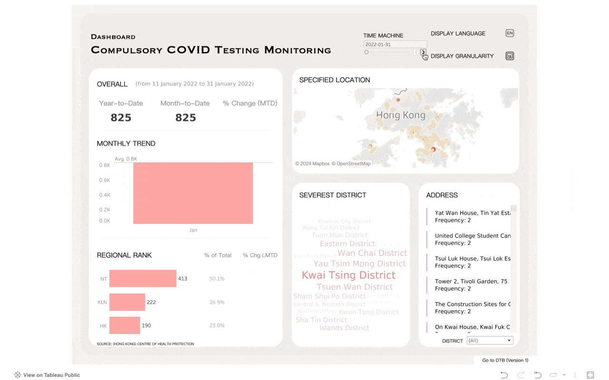
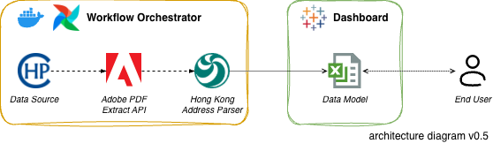

<!-- INTRODUCTION -->
# 💉 Compulsory COVID Testing Monitor
Amid the COVID-19 pandemic, the Hong Kong Government (HKG) strove to achieve [Dynamic Zero Infection](https://www.info.gov.hk/gia/general/202201/30/P2022013000492.htm) by introducing vaccine passports to encourage vaccination among the public. Furthermore, the HKG exercised its power under the Prevention and Control of Disease Ordinance (Chapter 599) to require individuals who had been present at specified premises to undergo a COVID-19 nucleic acid test.

To effectively monitor the COVID situation, we built an end-to-end pipeline solution that gathered data and created a dashboard. This dashboard allowed the public to understand the status of the pandemic and alerted them to potential outbreaks in their neighbourhoods.

  

  
  
  
<strong>First Published:</strong> 25 August 2022 <strong>Last Updated:</strong> 26 June 2026

<!-- ROADMAP -->
## Table of Contents
- [1 - Why We Visualise Compulsory Test Frequency](#1)
- [2 - How Many Times Have You Been Selected](#2)
    - [2.1 - Find the Latest Updates](#2.1)
    - [2.2 - Run Your Own CTN Monitor](#2.2)
- [3 - Behind the Scenes](#3)

<!-- SECTION 1 -->

## Why We Visualise Compulsory Test Frequency
Earlier, we came across an intriguing [post](https://forum.hkgolden.com/thread/7600216/page/1) on HKGolden discussing the nuisances caused by the Compulsory Testing Notice (CTN) and the desire for a _Dragon Tiger Billboard_ (also known as _龍虎榜_ in Chinese or _ranking billboard_ in English), which ranks the buildings that appeared most frequently on the CTN.

Unfortunately, there was no official publication providing such a ranking. The CTN was presented in PDF format, making it challenging to grasp the status of each location. Inspired by this idea, we initiated a project to create a dashboard that conveniently visualises the frequency of specified premises being listed on the CTN.

  
  
<i>a Golden Son had been tested 3 times within a month.</i>

<!-- SECTION 2 -->

## How Many Times Have You Been Selected
If you resided in Hong Kong in 2022, it was likely that you were asked to undergo a COVID test. However, did you know how many times you were officially requested to take a test?

### Find the Latest Updates
Simply visit the **Compulsory COVID Testing Monitor** on [Tableau Public](https://public.tableau.com/app/profile/jack.cky/viz/HongKongCompulsoryTestingNoticeDragonTigerBillboard/CTN), and you can find the most recently affected buildings.

> [!WARNING]  
> The dashboard is no longer being updated, and the last recorded entry for the CTN was on December 23, 2022.

  

### Run Your Own CTN Monitor
You can host the data pipeline using Docker Compose, which spins up an Apache Airflow cluster to orchestrate the ETL process. We use the [Adobe PDF Extract API](https://developer.adobe.com/document-services/apis/pdf-extract/) in the pipeline, which requires API credentials. You can create one for free by following their [instructions](https://developer.adobe.com/document-services/docs/overview/pdf-extract-api/quickstarts/extract-pdf/python/).

> [!CAUTION]  
> The pipeline is deprecated because _Dynamic Zero Infection_ had already been achieved 👌🏻.

<!-- SECTION 3 -->

## Behind the Scenes
The architecture is quite straightforward. Every day, the **Centre for Health Protection** released a [CTN](https://www.chp.gov.hk/en/features/105294.html) in PDF format, with tables detailing all specified locations.

For the extraction of these tables, we utilised the **Adobe PDF Extract API**, which captured tables from PDFs more accurately than other open-source tools. To enrich the dataset, we supplemented the addresses with spatial information using the _Hong Kong Address Parser_ to access the **Office of the Government Chief Information Officer**'s [APIs](https://github.com/chunlaw/HKAddressParser).

The ETL process is orchestrated by **Apache Airflow**, which schedules a daily DAG to automate the entire workflow. The processed data is consolidated using **Pandas** into an **Excel** file, which serves as the data source for the dashboard. The dashboard is crafted in **Tableau** and published on Tableau Public for the general public to review.

  

<!-- DISCLAIMER -->
---

**This was created as a personal hobby project and learning exercise.**
