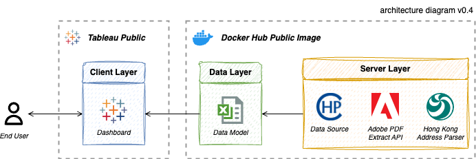

<!-- TITLE -->
# 💉 Compulsory COVID Testing Monitor

<!-- BACKBROUND -->
<div align="center">
  <div class="headline">
    <a href="https://www.chp.gov.hk/files/pdf/ctn.pdf">
      
    </a>
  </div>
  <div class="tag">
    <a href="https://hub.docker.com/r/jackcky/ctn_monitor"></a>
    <a href="https://public.tableau.com/app/profile/jack.cky/viz/HongKongCompulsoryTestingNoticeDragonTigerBillboard/CTN"></a>
  </div>
</div>

<br>Amid the COVID-19 pandemic, the Hong Kong Government (HKG) is striving to achieve _Dynamic Zero Infection_ by introducing vaccine passports to encourage public vaccinations. Furthermore, HKG is exercising its power under the Prevention and Control of Disease Ordinance (Chapter 599) to require those who have been present at specified premises to undergo a COVID-19 nucleic acid test.

To effectively monitor the COVID situation, we have built an end-to-end pipeline solution that gathers data and builds a dashboard. This dashboard allows the public (end users) to understand the current pandemic status and alerts them to potential outbreaks in their neighbourhoods.

<div align="right">
  <p>
    <i>Image Credit: <a href="https://www.info.gov.hk/gia/general/202202/10/P2022021000374.htm">info.gov.hk</a></i>
  </p>
</div>

**First Published:** 25 August 2022  
**Last Updated:** 22 July 2024


<!-- ROADMAP -->
## Table of Contents
- [1 - Motivation](#1)
- [2 - How Many Times You Have Been Selected?](#2)
    - [2.1 - Finding the Latest Updates](#2.1)
    - [2.2 - Hosting Your CTN Monitor](#2.2)
- [3 - Solution Architecture](#3)
    - [3.1 - Production Scenario](#3.1)


<!-- SECTION 1 -->
<a name="1"></a>

## Motivation: Visualise the Compulsory Test Frequency
Earlier, we came across an intriguing [post](https://forum.hkgolden.com/thread/7600216/page/1) on HKGolden discussing the nuisances caused by the Compulsory Testing Notice (CTN) and the desire for a _Dragon Tiger Billboard_ (also known as 龍虎榜 in Chinese or ranking billboard in English), which ranks the buildings appearing most frequently on the CTN.

Unfortunately, there is no official publication providing such a ranking. The CTN is presented in PDF format, making it challenging to grasp the status of each location. Inspired by this idea, we initiated a project to create a dashboard that conveniently visualises the frequency of specified premises being listed on the CTN.

<div align="center">
  <a href="https://forum.hkgolden.com/thread/7600216/page/1">
    
  </a>
</div>


<!-- SECTION 2 -->
<a name="2"></a>

## How Many Times You Have Been Selected?
If you resided in Hong Kong in 2022, it is likely you were asked to undergo a COVID test. However, do you know how many times you were officially requested to take a test?

<a name="2.1"></a>

### Finding the Latest Updates
Simply visit [Compulsory COVID Testing Monitor](https://public.tableau.com/app/profile/jack.cky/viz/HongKongCompulsoryTestingNoticeDragonTigerBillboard/CTN) on Tableau Public and you can view the most recently affected buildings. The last record of CTN was on 23 December 2022.

<div align="center">
  <a href="https://public.tableau.com/app/profile/jack.cky/viz/HongKongCompulsoryTestingNoticeDragonTigerBillboard/CTN">
    
  </a>
</div>

<a name="2.2"></a>

### Hosting Your CTN Monitor
You can host the data pipeline in your preferred environment using a Docker container. Docker simplifies deployment on any platform, whether on-premise or in the cloud. The instructions below will guide you on how to deploy it on your local machine. In this pipeline, we utilise the [Adobe PDF Extract API](https://developer.adobe.com/document-services/apis/pdf-extract/), which requires API credentials. You can create one for free by following their [instructions](https://developer.adobe.com/document-services/docs/overview/pdf-extract-api/quickstarts/python/). Be sure to update the `CLIENT_ID` and `CLIENT_SECRET` in the `./config/.env` before running the container.

```{sh}
$ git clone https://github.com/Jack-cky/Compulsory-COVID-Testing-Monitor
$ cd Compulsory-COVID-Testing-Monitor
$ cp ./config/.env.example ./config/.env
$ docker pull jackcky/ctn_monitor:v2
$ docker run --env-file ./config/.env jackcky/ctn_monitor:v2
```

> Note: double check you have updated the API credentials before running the pipeline.


<!-- SECTION 3 -->
<a name="3"></a>

## Solution Architecture
The architecture of our project is quite straightforward. Every day, the **Centre for Health Protection** releases a [CTN](https://www.chp.gov.hk/en/features/105294.html) which are structured in a tabular format, detailing all specified locations. For the extraction of these tables, we utilise the **Adobe PDF Extract API**. This API has been chosen due to its superior OCR capabilities tailored for this use case.

To enhance the dataset, we have added spatial information to supplement the addresses. This is achieved by calling an [API](https://github.com/chunlaw/HKAddressParser) from the **Hong Kong Address Parser**, a tool that harmonises with HKG's APIs. 

Given the well structured data, our data model remains fairly simple. It consolidates the data into an **Excel** file which then serves as the dashboard's data source. The dashboard is crafted in **Tableau** and published on Tableau Public for the general public to review. 

<div align="center">
  <a href="#0">
    
  </a>
</div>

<a name="3.1"></a>

### Production Scenario
Suppose you target to deploy the pipeline in an **AWS** environment. You would need to slightly adjust the pipeline to send output data to **RDS** (or any other SQL database). A **Lambda** function could then be scheduled to execute the docker image once every night. Given the light workload and small amount of data, the free tier of AWS would likely suffice to cover the costs. In essence, this means you could potentially host the data pipeline within an AWS environment without incurring any charges.


<!-- MISCELLANEOUS -->
<a name="4"></a>

## Change Logs
<details>
  <summary>[Ver. 2.0.1] 2024-07-25</summary>
  <div class="answer">
    Revamped the data pipeline and dashboard design.
    <ul>
      <li>Switched PDF table extraction from using Tabula-py to the Adobe PDF Extract API.</li>
      <li>Segregated the data pipeline into distinct modules.</li>
      <li>Enhanced the dashboard design for a more professional appearance.</li>
    </ul>
  </div>
</details>

<details>
  <summary>[Ver. 1.0.1] 2022-08-25</summary>
  <div class="answer">
    Initial publication.
  </div>
</details>


## License
This project is licensed under the MIT License. See the [LICENSE](./LICENSE) file for details. Feel free to fork and contribute to its further development!


## Credits
- Dashboard design: [交齊功課龍虎榜@Ho Dao College](https://hodao.edu.hk/CustomPage/131/2020-2021_05月份交齊功課龍虎榜.jpg)
- Icon image: [OnlineWebFonts](http://www.onlinewebfonts.com)
